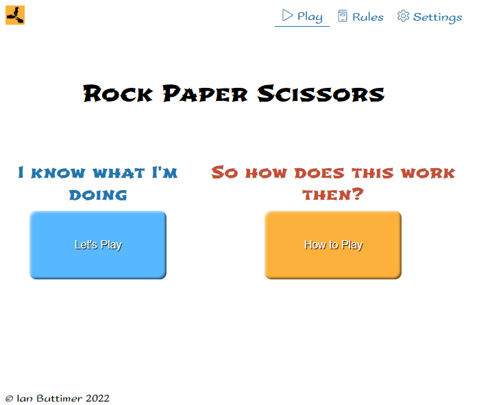
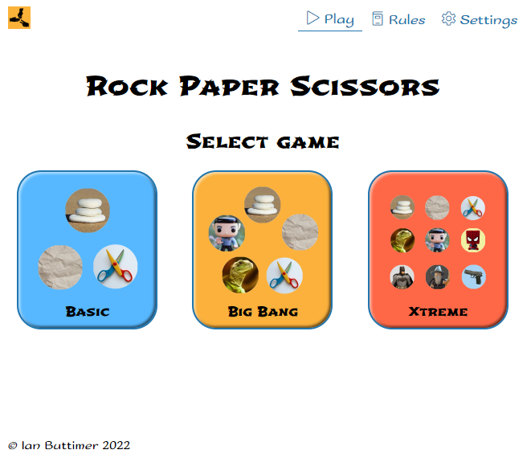
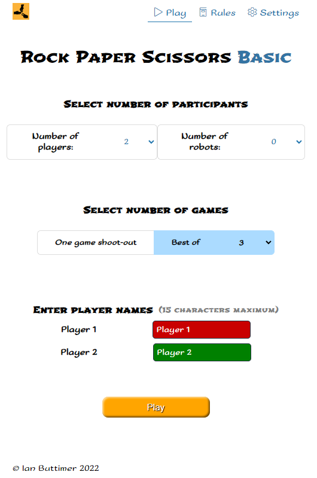
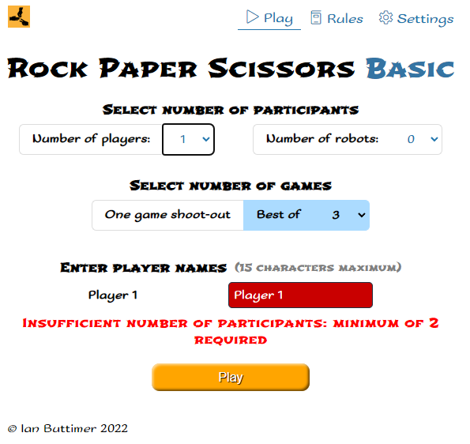
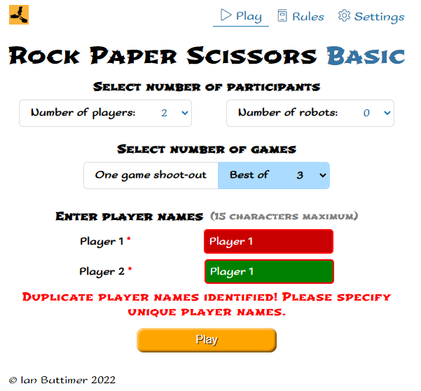
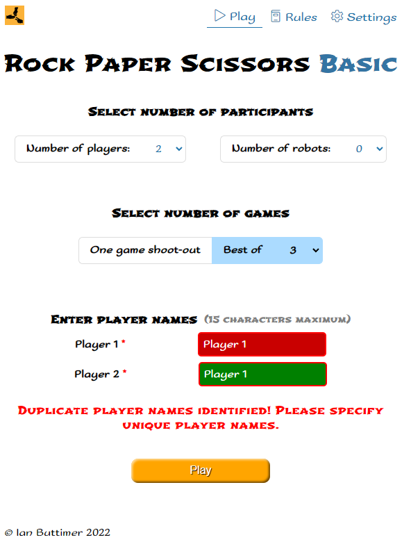
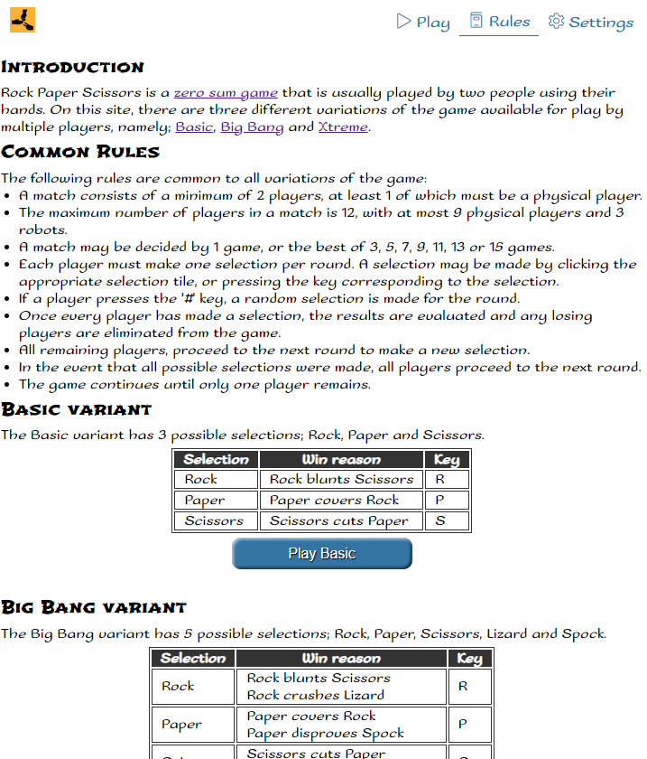

# Rock, Paper, Scissors Xtreme

Rock, Paper, Scissors Xtreme allows users to play three different variants of the the well known game Rock, Paper, Scissors.
The variants have an increasing level of difficulty, with the simplest being `Basic` which has three possible selections. `Big Bang` provides five possible selections, and `Xtreme` is the most difficult with nine possible selections. Up to nine players may play, together with up to three robots whose choices are determined by random by the computer.

The site is aimed at game enthusiasts and procrastinators.

###### Fig 1: Responsive Mockup


Section links
- [Features](#features)
- [Design](#design)
- [Development](#development)
- [Testing](#testing)
- [Deployment](#deployment)
- [Credits](#credits)

## Features 

### Existing Features
#### Common Features

##### Navigation Bar

  - The fully responsive navigation bar provides access to the `Play` and `Rules` pages, and `Settings` menu. The current page is highlighted for easy identification and users can easily navigate to the other pages.
  - The HTML code is contained in [index.html](index.html), and the CSS is in [styles-nav.css](assets/css/styles-nav.css).

###### Fig 2: Navigation Bar


##### Settings Menu

  - The `Settings Menu` allows the user to control aspects of the user experience.

  | Setting | Default | Description |
  |---------|---------|-------------|
  | Animation | On | Enable or disable animation<br>__Note:__ Animation may also be controlled by OS settings |
  | Sound | Off | Enable or disable sound |
  | Show start page | On | Enable or disable of the start page. If disabled, the `Game Selection` view is directly displayed. |
  | Show selection keys | On | Enable or disable of the display of the key for each player selection on the play view |

  - The JavaScript to generate the HTML code is contained in [game-params.js](assets/js/views/game-params.js), and the CSS is in [styles-params.css](assets/css/styles-params.css).

###### Fig 3: Settings Menu


#### Landing Page

  - The fully responsive `Landing` page, allows the user to select whether to review the game rules before playing or to proceed directly to game selection. The display of this page is controlled by the `Show start page` setting in the [Settings Menu](#settings-menu).
  - The JavaScript to generate the HTML code is contained in [landing.js](assets/js/views/landing.js), and the CSS is in [styles-landing.css](assets/css/styles-landing.css).

###### Fig 4: Landing Page
  | Landscape | Portrait |
  |---------|---------|
  |  |  |

#### Game Selection Page

  - The `Game Selection` page is fully responsive, and allows the user to select which particular variant of the game they wish to play. Details of the different variant are available in the [design document appendix](design/design.md#appendix).
  - The JavaScript to generate the HTML code is contained in [game-menu.js](assets/js/views/game-menu.js), and the CSS is in [styles-main.css](assets/css/styles-main.css).

###### Fig 5: Game Selection Page
  | Landscape | Portrait |
  |---------|---------|
  |  |  |

#### Game Parameter Page

  - The `Game Parameter` page is fully responsive, and allows the user to set the parameters for the match.

    | Parameter | Default | Description |
    |---------|---------|-------------|
    | Number of players | 2 | The number of physical players in the match. Possible values range from 1 to 9. |
    | Number of robots | 0 | The number of robots in the match. Possible values range from 0 to 3. |
    | Number of games | 3 | The maximum number of games in the match. A match is played in a 'Best Of' format, where the match winner is determined by the first player to win the required number of games. E.g. to win a 'Best Of 3' match, a player must win 2 games. Possible values are 1, 3, 5, 7, 9, 11, 13, or 15. |
    | Player names | 'Player &lt;num&gt;' | Player name with a maximum of 15 characters. |
  - The JavaScript to generate the HTML code is contained in [game-params.js](assets/js/views/game-params.js), and the CSS is in [styles-params.css](assets/css/styles-params.css).

###### Fig 6: Game Parameter Page
  | Landscape | Portrait |
  |---------|---------|
  |  |  |

  - The following user input validation is done:
    - Minimum number of participants is 2

      | Landscape | Portrait |
      |---------|---------|
      |  |  |

    - Duplicate player names are not allowed

      | Landscape | Portrait |
      |---------|---------|
      |  |  |

#### Game Play Page

  - The `Game Play` page is fully responsive, and allows each player to make a selection for each round. The available selection options is determined by the game variant being played.
  - The player may make their selection by clicking on the selection tile or entering the appropriate key. Please see the [Using the keyboard](https://ibuttimer.github.io/rock-paper-scissors-xtreme/test/generated/rules/rules.html#using-keyboard-info), [Basic variant](https://ibuttimer.github.io/rock-paper-scissors-xtreme/test/generated/rules/rules.html#basic-game-info), [Big Bang variant](https://ibuttimer.github.io/rock-paper-scissors-xtreme/test/generated/rules/rules.html#bigbang-game-info) and [Xtreme variant](https://ibuttimer.github.io/rock-paper-scissors-xtreme/test/generated/rules/rules.html#xtreme-game-info) sections on the [Rules Page](https://ibuttimer.github.io/rock-paper-scissors-xtreme/test/generated/rules/rules.html) for details of the keys.
  - The JavaScript to generate the HTML code is contained in [game-play.js](assets/js/views/game-play.js), and the CSS is in [styles-play.css](assets/css/styles-play.css).

###### Fig 7: Game Play Page
  | Landscape | Portrait |
  |---------|---------|
  |  |  |

##### Game Progress

The `Game Progress` widget, displays the current state with respect to the maximum possible number of games `Best of`, the current game number `Game` and the current round in that game `Round`. It is displayed on both the [Game Play Page](#game-play-page) and [Result Page](#result-page).

###### Fig 8: Game Progress
  | Landscape | Portrait |
  |---------|---------|
  |  |  |

##### Selection Keys Information

  | Description | Portrait |
  |---------|---------|
  | If the user presses the `Control` key during game play, a modal dialogue box is displayed with a list of the valid selections keys |  |
  | The key corresponding to each selection is also displayed on the each selection's tile. E.g. `Rock` may be selected using `R`.<br>__Note:__ The display of the  information is dependant on the `Show selection keys` setting from the [Settings Menu](#settings-menu). |  |

#### Result Page

  - The `Result` page is fully responsive, and displays the selections for all active players, the round result and winning player if the game is over.
  - The possible results are:
    - Play Again

      No players were eliminated, all players proceed to the next round.
    - Eliminations

      There are multiple winning players, losing players were eliminated. Only winning players proceed to the next round.
    - Winner

      The game is over, there was one winning player. The match will proceed to the next game with all players active again.
    - Match Over

      The match is over as a single winning player has won the required number of games.

  - The JavaScript to generate the HTML code is contained in [round-result.js](assets/js/views/round-result.js), and the CSS is in [styles-result.css](assets/css/styles-result.css).

###### Fig 9: Result Page
  | Landscape | Portrait |
  |---------|---------|
  |  |  |

##### Leader Board

The `Leader Board` widget, displays the current scores of all the players in descending order.

###### Fig 10: Leader Board


##### Elimination Information

The `Elimination Information` widget, displays the reasons why players were eliminated.

###### Fig 11: Elimination Information


#### Rules Page

  - The `Rules` page provides information regarding the general rules of the game, together with specific information regarding each game variant.
  - The user may begin a game by clicking the appropriate button `Play Basic`, `Play Big Bang` or `Play Xtreme`.
  - The JavaScript to generate the HTML code is contained in [game-rules.js](assets/js/views/game-rules.js), and the CSS is in [styles-rules.css](assets/css/styles-rules.css).

###### Fig 12: Rules Page



### Future enhancements
- The [Demonstration](#demonstration) functionality is currently quite limited, this may be extended to allow simulation of actual gameplay.
- The application does not make the best use of the available space when laying out player selection tiles in the play and result views.
  See [Issue #5](https://github.com/ibuttimer/rock-paper-scissors-xtreme/issues/5).

## Design 
The design specification is available in [design.md](design/design.md).

## Development
### Environment 
The development environment requires:
* [Node.js](https://nodejs.org/)
* [npm](https://www.npmjs.com/)
* [git](https://git-scm.com/)

> __Note:__ At time of development the LTS version of Node.js was v16.15.0.
> Please check [Using Jasmine with Node](https://jasmine.github.io/setup/nodejs.html#using-jasmine-with-node) to ensure version compatibility. 

### Setup
In an appropriate folder, run the following commands:
```shell
> git clone https://github.com/ibuttimer/rock-paper-scissors-xtreme.git
> cd rock-paper-scissors-xtreme
> npm install
```

#### Hosting
There are numerous methods of hosting the site for development purposes. Two convenient methods are:
- If using the [Visual Studio Code](https://code.visualstudio.com/) IDE, `Live Preview` may be used to host the site locally.
- On Windows [Pro/Enterprise and Education/Server](https://docs.microsoft.com/en-us/lifecycle/products/internet-information-services-iis), [Internet Information Services](https://www.iis.net/) may be used to host the site on the local network. After installing IIS:
  - By default IIS does not recognize WebP as an image type, so [add WebP](https://www.itnota.com/serving-webp-image-iis/) as an image type in MIME Types.

#### Environment
The [env.js](env.js) file provides configuration information to the application.
This configuration may be temporarily modified during development/testing using either of the following methods:
##### Git
Update the file as required and run `git update-index --assume-unchanged env.js`. This will cause Git to temporarily ignore the changed file. Run `git update-index --no-assume-unchanged env.js` to revert to normal. This reduces the possibility of inadvertently committing changes to the repository. 

See [git-update-index](https://git-scm.com/docs/git-update-index#Documentation/git-update-index.txt---no-assume-unchanged).

##### Local storage override
The local storage override facility may be used to change configuration values, as well as provide limited demonstration capabilities.
This feature works by loading a script which sets specified values in window.localStorage, prior to `script.js` being loaded.

###### Configuration override
The following configuration values may be changed:
- `ASSETS_BASE_URL`: the relative url to the assets folder
- `ENABLE_LOG`: enable console logging flag; set '0' to disable and '1' to enable

E.g. see [menu.html](test/generated/menu/menu.html) and [test-menu-config.js](test/generated/menu/test-menu-config.js).

###### Demonstration
Together with `ASSETS_BASE_URL` and `ENABLE_LOG`, the following values may be used to create a specific game status:
- `VARIANT`: the game variant; valid options are `Basic`, `BigBang` and `Xtreme`
- `NUM_PLAYERS`: the number of players
- `NUM_ROBOTS`: the number of robots
- `NUM_GAMES`: the number of games in the match
- `VIEW`: the view to display; valid options are:
  - `params` - game parameters view
  - `play` - game play view
  - `control` - view displayed is the result of processing input keys
  - `rules` - game rules view
- `INPUT`: a comma-separated list of game key characters representing player input. Possible values are:
  - alphabetic characters
  - modifier keys, `esc`, `alt`, `ctrl`, `meta`, `shift`
  - modified alphabetic characters i.e. '{modifier}+{char} e.g. 'ctrl+n'

E.g. see [basic-win](test/generated/win/basic-win.html) and [test-win-config.js](test/generated/win/test-basic-win-config.js).

> __Note:__ This functionality is presently limited to displaying the game parameters, game play and game result views. 
> It is also limited to one round.

#### Debugging mobile
Using Chrome on a pc and an Android device, it is possible to utilise Developer tools.
- Enable developer mode on the Android device
- Connect the Android device to a pc with Chrome installed
- Open the `chrome://inspect/#devices` tab in Chrome on the pc
- Click the Inspect option under the listing for the Android device
- A new Developer tools tab will open for the Chrome browser on the Android device

See [How to get the web console log in Chrome for Android](https://www.addictivetips.com/android/get-web-console-log-chrome-for-android/) for more details.

### Application structure
The application structure is based on [React Architecture: How to Structure and Organize a React Application](https://www.taniarascia.com/react-architecture-directory-structure/).

```
├─ README.md            - this file
├─ index.html           - landing page
├─ env.js               - environment configuration
├─ game.js              - game logic
├─ game-state.js        - game state
├─ routing.js           - view routing
├─ script.js            - application entry point
├─ design               - design documentation
│  └─ design.md         - design document
├─ assets               - app assets
│  ├─ audio             - audio files
│  ├─ css               - css files
│  ├─ img               - image files
│  └─ js                - JavaScript modules
│     ├─ components     - components JavaScript
│     ├─ utils          - JavaScript utility functions
│     └─ views          - views JavaScript
├─ spec                 - Jasmine test scripts
└─ test                 - test results
   ├─ generated         - Generated pages for test purposes
   └─ lighthouse        - Lighthouse test results
```

### General
- The page framework is in [index.html](index.html), containing the [Navigation Bar](#navigation-bar).
- The views are generated by updating the content of the &lt;`main`&gt; element in [index.html](index.html) from the various JavaScript modules.
- CSS classnames follow the [Block, Element, Modifier (BEM)](https://css-tricks.com/bem-101/) methodology.

## Testing 
Details of the testing undertaken are outlined in [test.md](test/test.md), along with the results.

## Deployment

The site was deployed as a static website, hosted directly from the GitHub repository via [GitHub Pages](https://pages.github.com/).

The following steps were followed to deploy the website: 
  - Navigate to the `Settings` tab in the GitHub repository
  - Under the `Code and automation` section, select `Pages`
  - Under `Source`, select `main` from the Branch dropdown menu
  - Once the website is published, the page will refresh indicting the successful deployment, and providing link to the live website. 

The live website is available at [https://ibuttimer.github.io/rock-paper-scissors-xtreme/](https://ibuttimer.github.io/rock-paper-scissors-xtreme/)


## Credits 

The following resources were used to build the website.

### Content 

- The icons on the site were taken from [Lineicons](https://lineicons.com/)
- The favicon for the site was generated by [RealFaviconGenerator](https://realfavicongenerator.net/) from image by <a href="https://pixabay.com/users/openclipart-vectors-30363/?utm_source=link-attribution&amp;utm_medium=referral&amp;utm_campaign=image&amp;utm_content=156171">OpenClipart-Vectors</a> from <a href="https://pixabay.com/?utm_source=link-attribution&amp;utm_medium=referral&amp;utm_campaign=image&amp;utm_content=156171">Pixabay</a>
- Sticky footer based on [There is flexbox](https://css-tricks.com/couple-takes-sticky-footer/#aa-there-is-flexbox) from [Sticky Footer, Five Ways by Chris Coyier](https://css-tricks.com/couple-takes-sticky-footer/)
- Number of games radio switch based on [Responsive Toggle Switch](https://codepen.io/dsenneff/pen/ZoLVZW) by Darin on [Free Frontend - 88 Radio Buttons CSS](https://freefrontend.com/css-radio-buttons/)
- Settings dropdown menu based on [CSS Dropdowns](https://www.w3schools.com/css/css_dropdowns.asp)
- Settings toggle switch based on [Animated CSS Toggle Switch](https://codepen.io/garetmckinley/pen/YmxYZr?editors=1100) by Garet McKinley from [72 CSS Toggle Switches](https://freefrontend.com/css-toggle-switches/)
- Modal dialogue courtesy of [tingle.js](https://tingle.robinparisi.com/)

### Media
- Rock image by <a href="https://pixabay.com/users/publicdomainpictures-14/?utm_source=link-attribution&amp;utm_medium=referral&amp;utm_campaign=image&amp;utm_content=15712">PublicDomainPictures</a> from <a href="https://pixabay.com/?utm_source=link-attribution&amp;utm_medium=referral&amp;utm_campaign=image&amp;utm_content=15712">Pixabay</a>
- Paper Image by <a href="https://pixabay.com/users/kavowo-6764465/?utm_source=link-attribution&amp;utm_medium=referral&amp;utm_campaign=image&amp;utm_content=3155438">KAVOWO</a> from <a href="https://pixabay.com/?utm_source=link-attribution&amp;utm_medium=referral&amp;utm_campaign=image&amp;utm_content=3155438">Pixabay</a>
- Scissors image by <a href="https://pixabay.com/users/monfocus-2516394/?utm_source=link-attribution&amp;utm_medium=referral&amp;utm_campaign=image&amp;utm_content=1803670">Monfocus</a> from <a href="https://pixabay.com/?utm_source=link-attribution&amp;utm_medium=referral&amp;utm_campaign=image&amp;utm_content=1803670">Pixabay</a>
- Lizard image by <a href="https://pixabay.com/users/publicdomainpictures-14/?utm_source=link-attribution&amp;utm_medium=referral&amp;utm_campaign=image&amp;utm_content=22258">PublicDomainPictures</a> from <a href="https://pixabay.com/?utm_source=link-attribution&amp;utm_medium=referral&amp;utm_campaign=image&amp;utm_content=22258">Pixabay</a>
- Spock image by <a href="https://pixabay.com/users/brenkee-2021352/?utm_source=link-attribution&amp;utm_medium=referral&amp;utm_campaign=image&amp;utm_content=1541528">Benjamin Balazs</a> from <a href="https://pixabay.com/?utm_source=link-attribution&amp;utm_medium=referral&amp;utm_campaign=image&amp;utm_content=1541528">Pixabay</a>
- Batman image by <a href="https://pixabay.com/users/erikawittlieb-427626/?utm_source=link-attribution&amp;utm_medium=referral&amp;utm_campaign=image&amp;utm_content=1822445">ErikaWittlieb</a> from <a href="https://pixabay.com/?utm_source=link-attribution&amp;utm_medium=referral&amp;utm_campaign=image&amp;utm_content=1822445">Pixabay</a>
- Spiderman image by <a href="https://pixabay.com/users/sutulo-3073859/?utm_source=link-attribution&amp;utm_medium=referral&amp;utm_campaign=image&amp;utm_content=3859527">sutulo</a> from <a href="https://pixabay.com/?utm_source=link-attribution&amp;utm_medium=referral&amp;utm_campaign=image&amp;utm_content=3859527">Pixabay</a>
- Wizard image by <a href="https://pixabay.com/users/aitoff-388338/?utm_source=link-attribution&amp;utm_medium=referral&amp;utm_campaign=image&amp;utm_content=4603354">Andrew Martin</a> from <a href="https://pixabay.com/?utm_source=link-attribution&amp;utm_medium=referral&amp;utm_campaign=image&amp;utm_content=4603354">Pixabay</a>
- Gun image by <a href="https://pixabay.com/users/dirtdiver38-2109394/?utm_source=link-attribution&amp;utm_medium=referral&amp;utm_campaign=image&amp;utm_content=3149414">dirtdiver38</a> from <a href="https://pixabay.com/?utm_source=link-attribution&amp;utm_medium=referral&amp;utm_campaign=image&amp;utm_content=3149414">Pixabay</a>
- [Error beep sound](https://www.soundjay.com/buttons/sounds/beep-10.mp3) courtesy of [SoundJay.com](https://www.soundjay.com/beep-sounds-1.html)
- [Beep sound](https://www.soundjay.com/buttons/sounds/beep-22.mp3) courtesy of [SoundJay.com](https://www.soundjay.com/beep-sounds-1.html)
- [Winner sound](https://pixabay.com/sound-effects/success-fanfare-trumpets-6185/) from <a href="https://pixabay.com/?utm_source=link-attribution&amp;utm_medium=referral&amp;utm_campaign=music&amp;utm_content=6185">Pixabay</a>
- The [Responsive Mockup](#fig-1-responsive-mockup) image was generated courtesy of [Multi Device Website Mockup Generator](https://techsini.com/multi-mockup/)