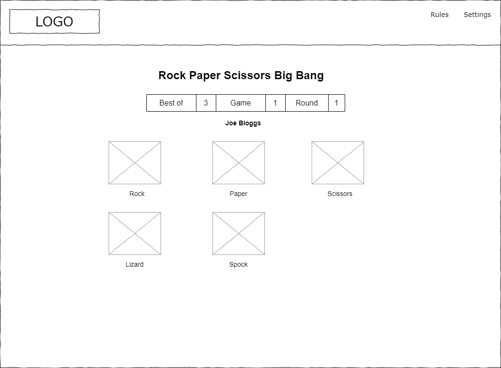
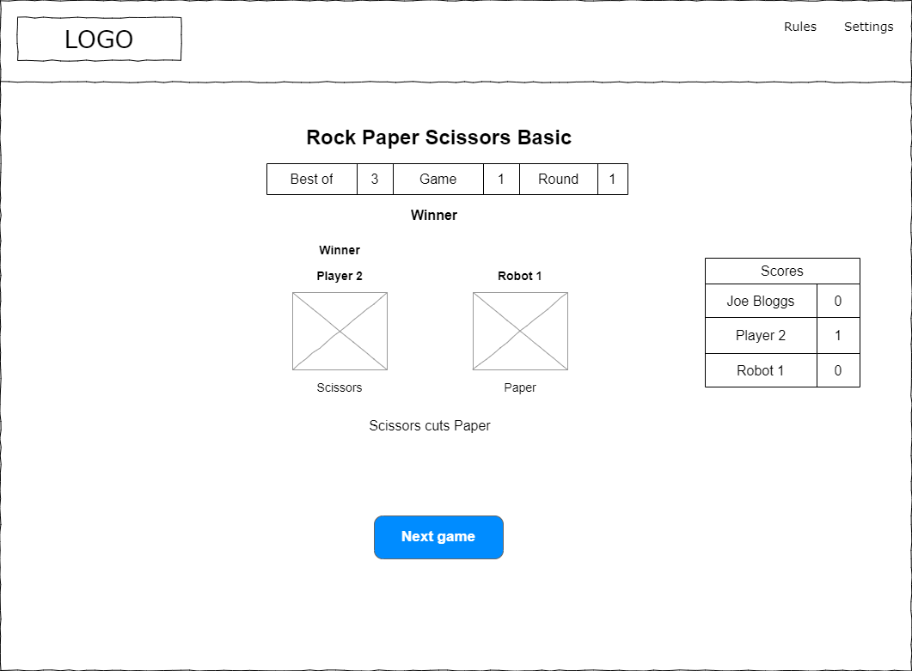

# Strategy
The strategy is to create a website allowing the user to play variations of the game Rock, Paper, Scissors. It will allow the user to play in an entertaining and visually pleasing environment.

# Scope
The scope of the project will be to allow the user to:
- Play different variants of the game:
  - Basic

      The original version of the the game with 3 selection options; Rock, Paper and Scissors.

      [Basic rules](#basic-rules)

  - Big Bang

      The expanded version of the game invented by [Sam Kass](https://bigbangtheory.fandom.com/wiki/Sam_Kass) and made popular by the TV sitcom [The Big Bang Theory](https://www.imdb.com/title/tt0898266/) with 5 selection options; Rock, Paper, Scissors, Lizard and Spock.
      
      [Big Bang rules](#big-bang-rules)

  - Xtreme

      An extreme version of the game suggested in [Winning at Rock-Paper-Scissors… Lizard-Spock!](https://www.naturphilosophie.co.uk/winning-rock-paper-scissors-lizard-spock/) with 9 selection options; Rock, Paper, Scissors, Lizard, Spock, Spiderman, Batman, Wizard and Glock.
      
      [Xtreme rules](#xtreme-rules)

- Play against the computer
- Play in multi-player mode

    [Multi-player rules](#multi-player-rules)

- Maintain players scores


## User Stories
As a user:
- I want to understand the purpose of the site.
- I want to be able to easily navigate the site.
- I want to find the site visually pleasing.
- I want to want be able to view the site on a variety of devices and screen sizes.
- I want to want be able to select the game variant to play.
- I want to want be able to select how many games to play.
- I want to want be able to play the game using mouse and/or keyboard.
- I want to want be able to see my score.
- I want to want be able to set my player name.

# Structure

# Skeleton
The website will consist of four pages:

## Home page

The Home page will allow the user to select the game variant to play. 

## Game Parameters page

The Game Parameters page will allow the user to select the game parameters.

## Game Play page

The Game Play page allow each user to select a gesture from the current round.

## Round Result page

The Round Result page will display the round result.

## Game Result page

The Game Result page will display the game result.

## Game Rules page

The Game Rules page will display the rules of each game variant.

# General layout

Each of the pages will have the same general layout:

- A menu at top of page, with current page highlighted in a different colour. The buttons will contain the appropriate text, and icons will be used to visually represent the function of each page.

# Wireframes
Wireframes of page layouts are as followings:

## Home page

The Home page will have the following features:
- The option to start playing a game or get how to play instructions

| Large screen | Small screen |
|-|-|
|||

## Game Select page

The Game Select page will have the following features:
- The option to select which game variant to play

| Large screen | Small screen |
|-|-|
|||

## Game Parameters page

The Game Parameters page will have the following features:
- The option to select the number of players
- The option to select the number of robots
- The option to select the number of game to play
- The option to set the player names

| Large screen | Small screen |
|-|-|
|||

## Game Play page

The Game Play page will be displayed for each player in turn and will have the following features:
- The option to select a gesture

| Large screen | Small screen |
|-|-|
|||
|| Same as Basic with additional gesture options |
|| Same as Basic with additional gesture options |

## Round Result page

The Round Result page will have the following features:
- Display gesture selected by each player in the current round
- Display current score for each player
- Display explanation of result
- Button to start next round

| Large screen | Small screen |
|-|-|
|||

## Game Result page

The Game Result page will have the following features:
- Display gesture selected by each player in the final round
- Display current score for each player
- Display explanation of result
- Button to start next game

| Large screen | Small screen |
|-|-|
|||

## Game Rules page

The Game Rules page will have the following features:
- Display rules for each game variant
- Buttons to start playing each game variant

| Large screen | Small screen |
|-|-|
|||

## Settings side panel

The Settings side panel will have the following features:
- Enable/disable animations
- Enable/disable audio


# UX Surface
## Font
The font used for title text will be [Shojumaru](https://fonts.google.com/specimen/Shojumaru?preview.text=Rock%20Paper%20Scissors%20Xtreme&preview.text_type=custom) from Google fonts. 
The font used for paragraph text will be [Sofadi One](https://fonts.google.com/specimen/Sofadi+One?preview.text=Rock%20Paper%20Scissors%20Xtreme&preview.text_type=custom#type-tester) from Google fonts.

```css
@import url('https://fonts.googleapis.com/css2?family=Shojumaru&family=Sofadi+One&display=swap');

font-family: 'Shojumaru', cursive;
font-family: 'Sofadi One', cursive;
```


## Colour Scheme

[](https://coolors.co/2176ae-57b8ff-b66d0d-fbb13c-fe6847)

## UX Elements

- The game gesture icons will be images which transform as required.

## Accessibility
The guidelines outlined in the following will be followed:

- [W3C - Using ARIA](https://www.w3.org/TR/using-aria/)
- [TPGi - Short note on aria-label, aria-labelledby, and aria-describedby](https://www.tpgi.com/short-note-on-aria-label-aria-labelledby-and-aria-describedby/)


# Appendix
## Basic rules
__Number of selections:__ 3

__Selections:__
|            | Key |
|------------|:---:|
| `Rock`     |  R  |
| `Paper`    |  P  |
| `Scissors` |  S  |

__Win matrix__[^win_matrix]:

|            | `Rock`  | `Paper` | `Scissors` | Description |
|------------|:-------:|:-------:|:----------:|-------------|
| `Rock`     |   -     | &cross; | &check;    | `Rock` blunts `Scissors` |
| `Paper`    | &check; |   -     | &cross;    | `Paper` covers `Rock` |
| `Scissors` | &cross; | &check; |    -       | `Scissors` cuts `Paper` |

See [The Official Rules of Rock Paper Scissors](https://wrpsa.com/the-official-rules-of-rock-paper-scissors/).

## Big Bang rules
__Number of selections:__ 5

__Selections:__
|            | Key |
|------------|:---:|
| `Rock`     |  R  |
| `Paper`    |  P  |
| `Scissors` |  S  |
| `Lizard`   |  L  |
| `Spock`    |  V  |

__Win matrix__[^win_matrix]:

|            | `Rock`  | `Paper` | `Scissors` | `Lizard`  | `Spock` | Description |
|------------|:-------:|:-------:|:----------:|:---------:|:-------:|-------------|
| `Rock`     |   -     | &cross; | &check;    | &check;   | &cross; | `Rock` blunts `Scissors`<br>`Rock` crushes `Lizard` |
| `Paper`    | &check; |   -     | &cross;    | &cross;   | &check; | `Paper` covers `Rock`<br>`Paper` disproves `Spock` |
| `Scissors` | &cross; | &check; |    -       | &check;   | &cross; | `Scissors` cuts `Paper`<br>`Scissors` decapitates `Lizard` |
| `Lizard`   | &cross; | &check; | &cross;    |    -      | &check; | `Lizard` eats `Paper`<br>`Lizard` poisons `Spock` |
| `Spock`    | &check; | &cross; | &check;    | &cross;   |    -    | `Spock` vaporises `Rock`<br>`Spock` smashes `Scissors` |

See [Rock, Paper, Scissors, Lizard, Spock](https://bigbangtheory.fandom.com/wiki/Rock,_Paper,_Scissors,_Lizard,_Spock).

## Xtreme rules
__Number of selections:__ 9

__Selections:__
|            | Key |
|------------|:---:|
| `Rock`     |  R  |
| `Paper`    |  P  |
| `Scissors` |  S  |
| `Lizard`   |  L  |
| `Spock`    |  V  |
| `Spiderman`|  I  |
| `Batman`   |  B  |
| `Wizard`   |  W  |
| `Glock`    |  G  |

__Win matrix__[^win_matrix]:

|          | `Rock`  | `Paper`   | `Scissors` | `Lizard`  | `Spock`   | `Spiderman` | `Batman`  | `Wizard`  | `Glock`   | Description |
|----------|:-------:|:-------:|:--------:|:-------:|:-------:|:---------:|:-------:|:-------:|:-------:|-------------|
| `Rock`   |   -     | &cross; | &check;  | &check; | &cross; | &check;   | &cross; | &check; | &cross; | `Rock` blunts `Scissors`<br>`Rock` crushes `Lizard`<br>`Rock` knocks out `Spiderman`<br>`Rock` interrupts `Wizard` |
| `Paper`    | &check; |   -     | &cross;  | &cross; | &check; | &cross;   | &check; | &cross; | &check; | `Paper` covers `Rock`<br>`Paper` disproves `Spock`<br>`Paper` delays `Batman`<br>`Paper` jams `Glock` |
| `Scissors` | &cross; | &check; |    -     | &check; | &cross; | &check;   | &cross; | &check; | &cross; | `Scissors` cuts `Paper`<br>`Scissors` decapitates `Lizard`<br>`Scissors` cuts `Spiderman`<br>`Scissors` cuts `Wizard` |
| `Lizard`   | &cross; | &check; | &cross;  |    -    | &check; | &cross;   | &check; | &cross; | &check; | `Lizard` eats `Paper`<br>`Lizard` poisons `Spock`<br>`Lizard` confuses `Batman`<br>`Lizard` is too small for `Glock` |
| `Spock`    | &check; | &cross; | &check;  | &cross; |    -    | &check;   | &cross; | &check; | &cross; | `Spock` vaporises `Rock`<br>`Spock` smashes `Scissors`<br>`Spock` befuddles `Spiderman`<br>`Spock` zaps `Wizard` |
| `Spiderman`| &cross; | &check; | &cross;  | &check; | &cross; |    -      | &cross; | &check; | &check; | `Spiderman` rips `Paper`<br>`Spiderman` contests `Lizard`<br>`Spiderman` annoys `Wizard`<br>`Spiderman` disarms `Glock` |
| `Batman`   | &check; | &cross; | &check;  | &cross; | &check; | &check;   |    -    | &cross; | &cross; | `Batman` explodes `Rock`<br>`Batman` dismantles `Scissors`<br>`Batman` hangs `Spock`<br>`Batman` scares `Spiderman` |
| `Wizard`   | &cross; | &check; | &cross;  | &check; | &cross; | &cross;   | &check; |    -    | &check; | `Wizard` burns `Paper`<br>`Wizard` transforms `Lizard`<br>`Wizard` stuns `Batman`<br>`Wizard` melts `Glock` |
| `Glock`    | &check; | &cross; | &check;  | &cross; | &check; | &cross;   | &check; | &cross; |   -     | `Glock` breaks `Rock`<br>`Glock` dents `Scissors`<br>`Glock` shoots `Spock`<br>`Glock` kills `Batman`’s mum |

See [Winning at Rock-Paper-Scissors… Lizard-Spock!](https://www.naturphilosophie.co.uk/winning-rock-paper-scissors-lizard-spock/).

## Multi-player rules
- Everyone in the group plays a gesture.
- If all gestures are showing everyone plays again.
- Otherwise
  - Basic game

    If only 2 gestures are showing the players showing the greater gesture stay the others leave.

  - Big Bang/Xtreme game

    If one gesture was shown by more players, players showing a weaker gesture leave, other players remain.
    If 2 or more gestures were shown equally, everyone plays again.

Adapted from [How to Play Rock Paper Scissors with More than Two Players](https://wrpsa.com/how-to-play-rock-paper-scissors-with-more-than-two-players/)

[^win_matrix]: To find the result of two selections, find the first selection in the leftmost column and the second selection in the top row, where the row and column intersect is the result; &check; if first selection wins, &cross; if first selection loses.
